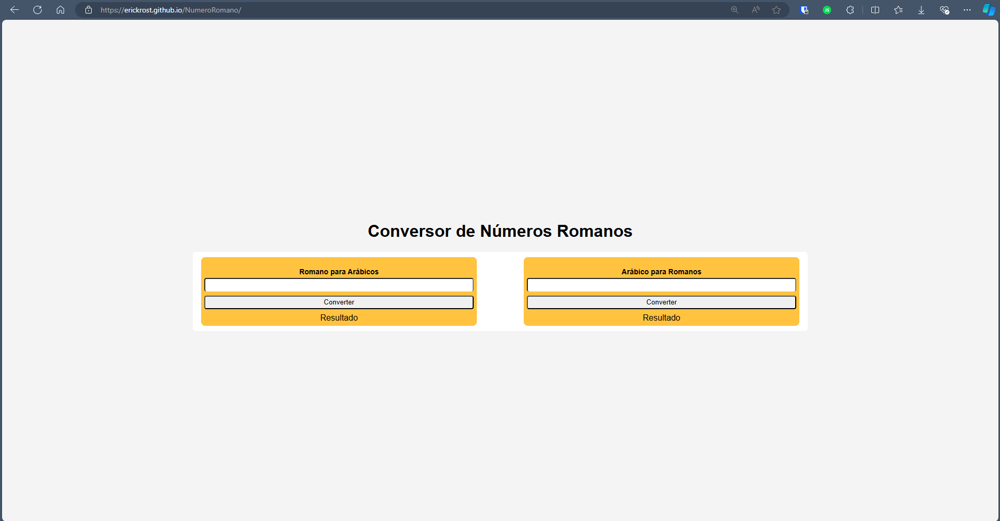

Projeto relizado para o processo seletivo na empresa Demander Força de Vendas.

Deploy do Projeto: https://erickrost.github.io/NumeroRomano/

Sobre:

     Criar um código usando POO para conversão de números romanos para números reais.

        Requisitos:
            1. Converte um número real para um número romano.
            2. Converter um número romano pra número real.

        Exemplos:
            9       -> IX
            39      -> XXXIX
            IX      -> 9
            XXXIX   -> 39

        Programação Orientada à Objetos.
        Código não-procedural.

        Diferenciais:
        - interface gráfica, para apresentação, só mandar o código fonte não é tão atraente

Interface Gráfica:

   
